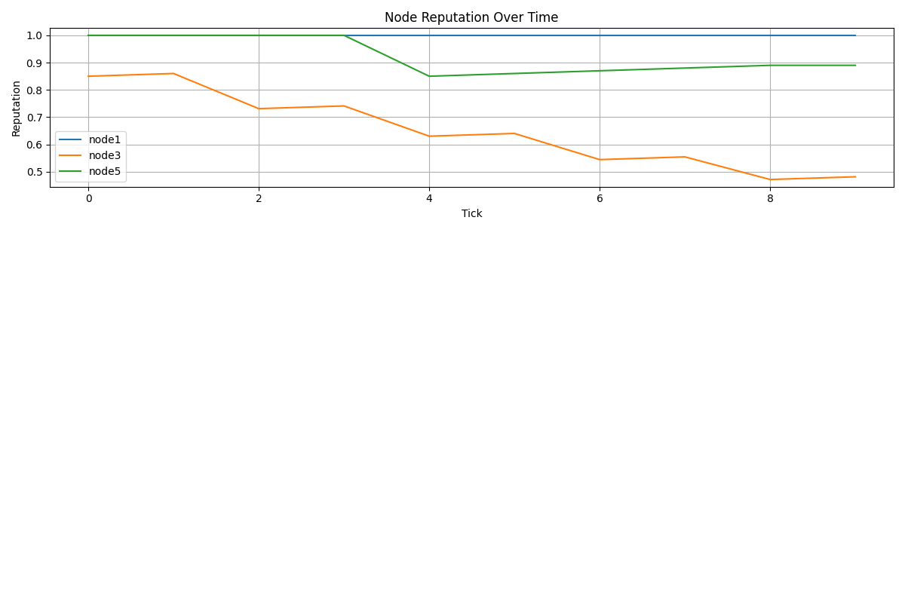
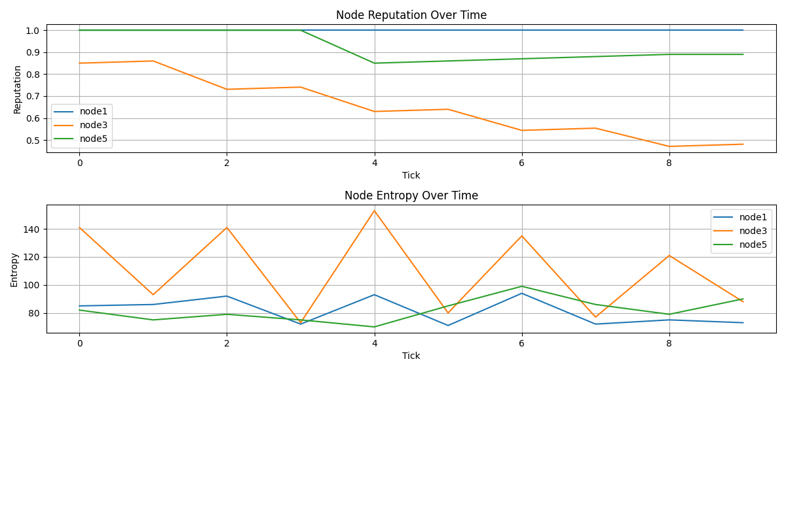
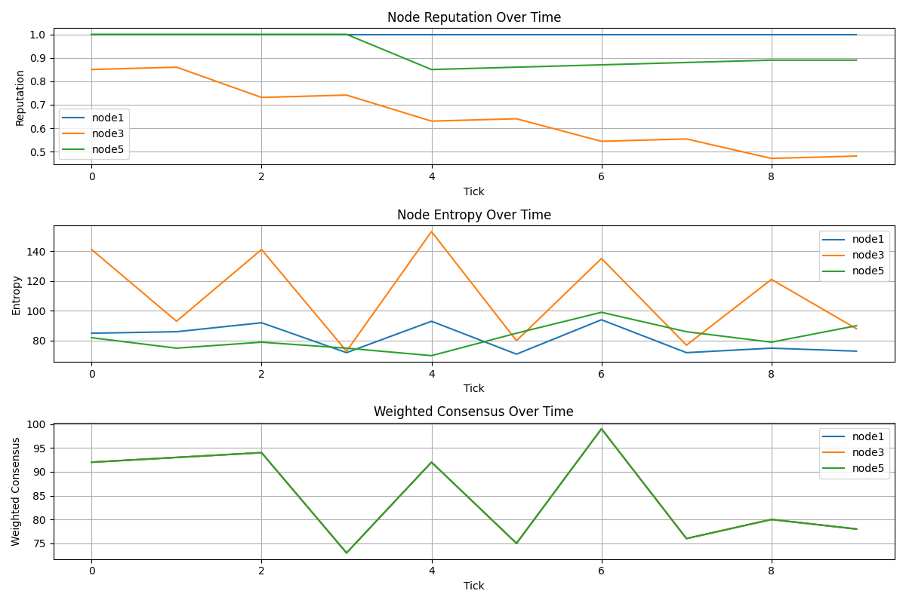

# Phase 8 — Node Governance & Weighted Consensus with Stake

## Overview
- Introduced node stake to influence consensus.
- Reputation adjusts dynamically based on delta from consensus.
- High-stake, high-reputation nodes dominate weighted consensus.
- Adversarial behavior is mitigated by stake weighting.

## Observations
- Reputation trends show which nodes are consistently reliable.
- Weighted consensus reflects both reputation and stake.
- Entropy trends indicate network stability over time.

## Plots

## Logs
CSV logs of all nodes included for reproducibility:
- `node1_log.csv`
- `node3_log.csv`
- `node5_log.csv`
